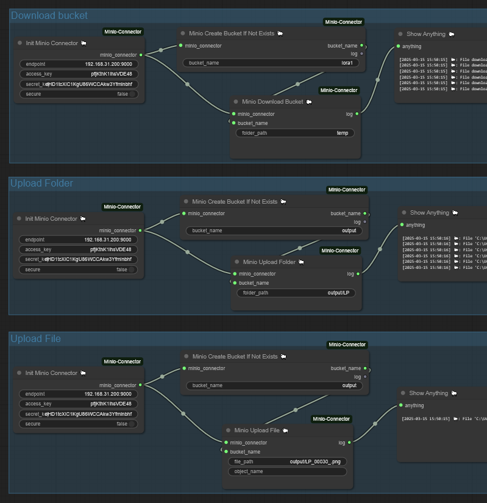

# ComfyUI-MinioConnector  

[English](README.md) | [简体中文](README_CN.md)  

**ComfyUI-MinioConnector** is a plugin for the ComfyUI ecosystem, provides a series of utility nodes designed for interacting with MinIO, including functionalities such as uploading and downloading files and folders, as well as creating buckets if they do not already exist.  

---

## Usage

---

## Contact Me  

- **Bilibili**: [@黎黎原上咩](https://space.bilibili.com/449342345)  
- **YouTube**: [@SweetValberry](https://www.youtube.com/@SweetValberry)  
