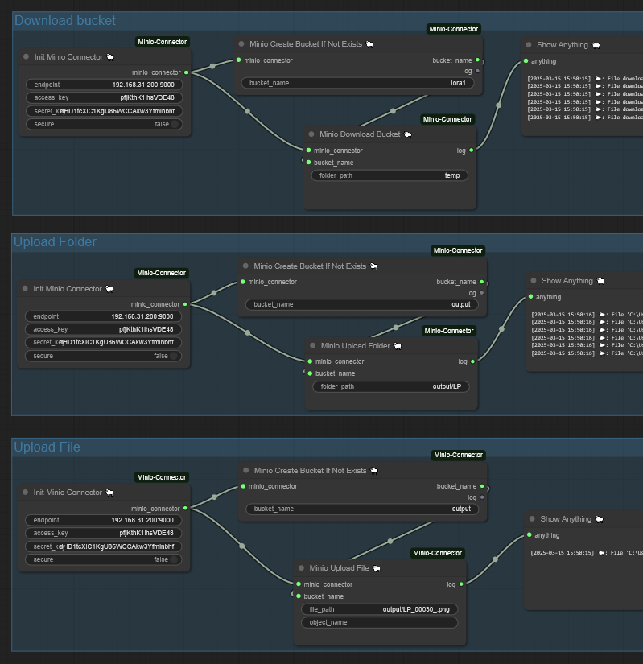

# ComfyUI-MinioConnector

[English](README.md) | [简体中文](README_CN.md)

**ComfyUI-MinioConnector** 是 ComfyUI 生态系统的一个插件，提供了一系列用于与 MinIO 交互的实用节点，包括上传和下载文件夹与文件以及在桶不存在时创建桶等功能。

---

## 使用方法

---

## 联系方式

- **B站**: [@黎黎原上咩](https://space.bilibili.com/449342345)
- **YouTube**: [@SweetValberry](https://www.youtube.com/@SweetValberry)